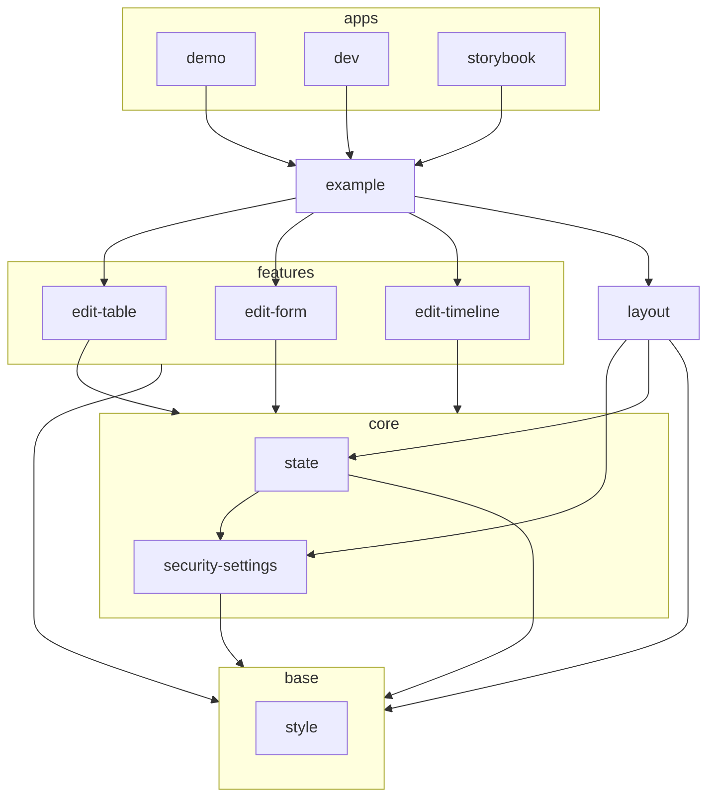

# FormsWizard Processing

## Open a Demo

Run the following command:

```sh
pnpm export
(cd apps/demo/out/; python -m http.server) & 
xdg-open http://localhost:8000
```


## Apps and Packages



This [Turborepo](https://turbo.build/) includes the following packages/apps:

- `./apps/demo`: a [Next.js](https://nextjs.org/) app containing the live demo
- `./apps/dev`: another [Next.js](https://nextjs.org/) app including some dev output
- `./apps/storybook`: documentation of all relevant React components via [storybook.js](https://storybook.js.org/)


- `./packages/example`: an example App (used by `demo` and `dev`)
- `./packages/layout`: ui components used in `./packages/example`


- `./packages/edit*`: editors/visualizations using the same `./packages/state`


- `./packages/state`: the redux state used by `./packages/edit*`
- `./packages/security-settings`: provider for security relevant state, enforcing security using declarative threat models


- `./packages/style`: themes shared for all components


Each package/app is 100% [TypeScript](https://www.typescriptlang.org/).


## Build

To build all apps and packages, run:

```sh
pnpm build
```

## Develop

To develop all apps and packages, run:

```sh
pnpm dev
```

To synchorize several browser instances via Y-webrtc, start a signaling server:

```sh
./node_modules/y-webrtc/bin/server.js
```

## Test

To run all tests, run:

```sh
pnpm test
```

Or to watch for changed files:

```sh
pnpm testWatch
```

## Update dependencies

To update all dependencies, run:

```sh
pnpm update -r --latest
```
