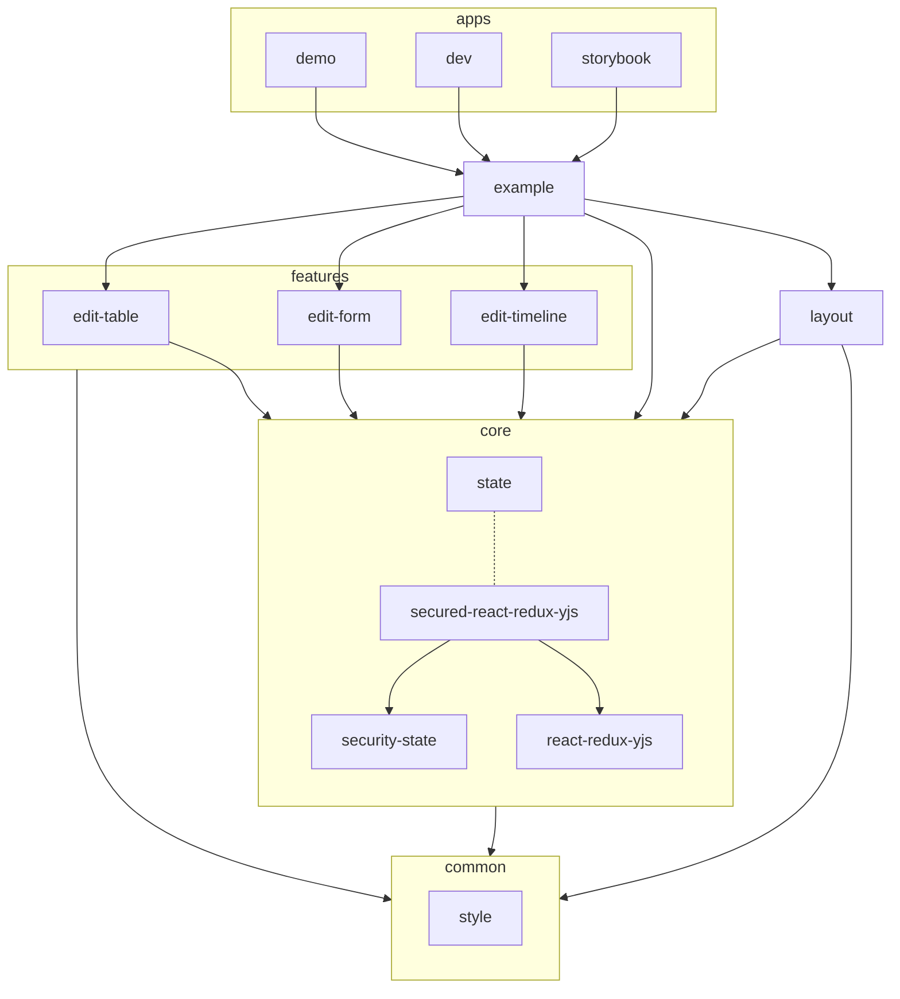

# FormsWizard Processing

## Open a Demo

For a first public demo, you can try our main app: https://formswizard.github.io/formswizard/new

## Apps and Packages



This [Turborepo](https://turbo.build/) includes the following packages/apps:

### Apps
- `./apps/demo`: A [Next.js](https://nextjs.org/) app containing the live demo.
- `./apps/dev`: Another [Next.js](https://nextjs.org/) app including some dev output.
- `./apps/storybook`: Documentation of all relevant React components via [storybook.js](https://storybook.js.org/).

### Example
- `./packages/example`: An example App (used by `demo` and `dev`).
- `./packages/layout`: UI components used in `./packages/example`.

### Core
- `./packages/state`: The shared redux state used by all features (`./packages/edit*`). Collaboration of this state is provided by `secured-react-redux-yjs`.
- `./packages/secured-react-redux-yjs`: Secures settings for `react-redux-yjs` with `security-state`
- `./packages/react-redux-yjs`: Provider to exchange redux state via [Yjs](https://yjs.dev/)
- `./packages/security-state`: Provider for security relevant state, enforcing security using declarative threat models.

### Features
- `./packages/edit*`: Editors/Visualizations using the same `./packages/state`.

### Common
- `./packages/style`: Themes shared for all components.


Each package/app is 100% [TypeScript](https://www.typescriptlang.org/).


## Build

To build all apps and packages, run:

```sh
pnpm build
```

Than you should be able to serve it with an arbitrary webserver:

```sh
(cd apps/demo/out/; python -m http.server) & 
xdg-open http://localhost:8000
```

## Develop

To develop all apps and packages, run:

```sh
pnpm dev
```

To synchorize several browser instances via Y-webrtc, start a signaling server:

```sh
./node_modules/y-webrtc/bin/server.js
```

## Test

To run all tests, run:

```sh
pnpm test
```

Or to watch for changed files:

```sh
pnpm testWatch
```

## Update dependencies

To update all dependencies, run:

```sh
pnpm update -r --latest
```
